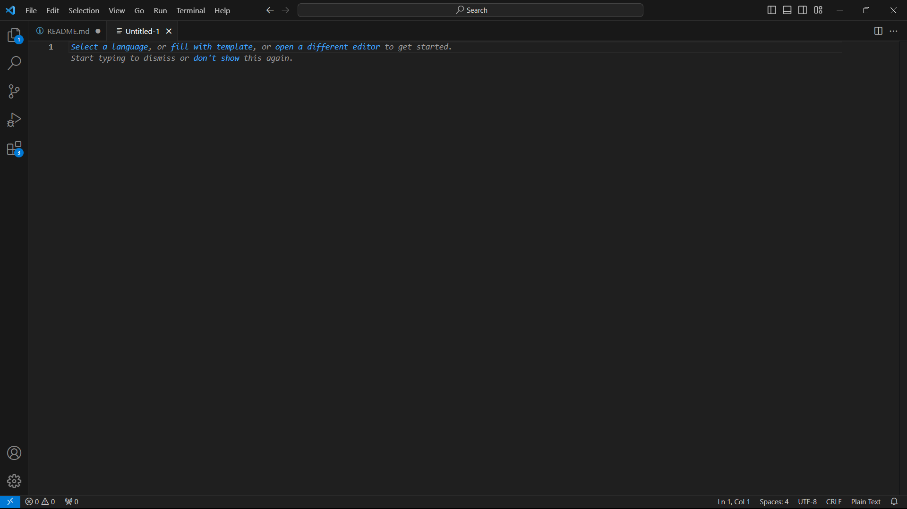
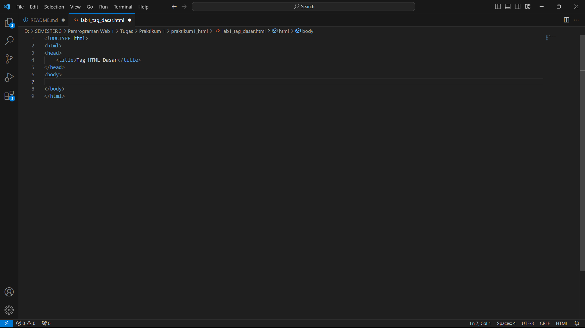
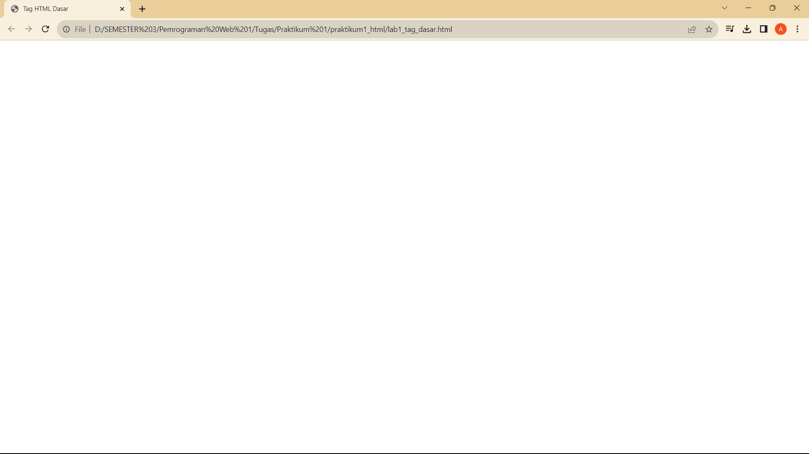
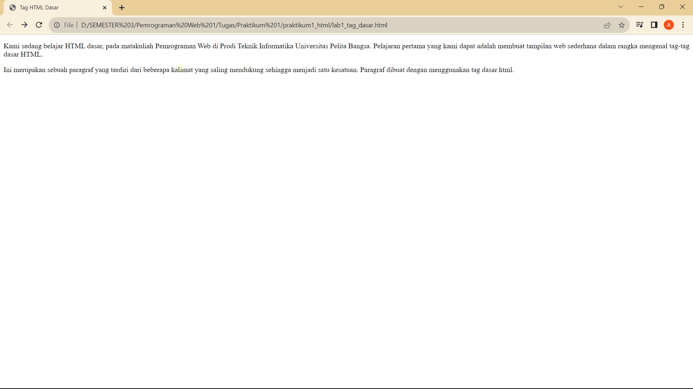
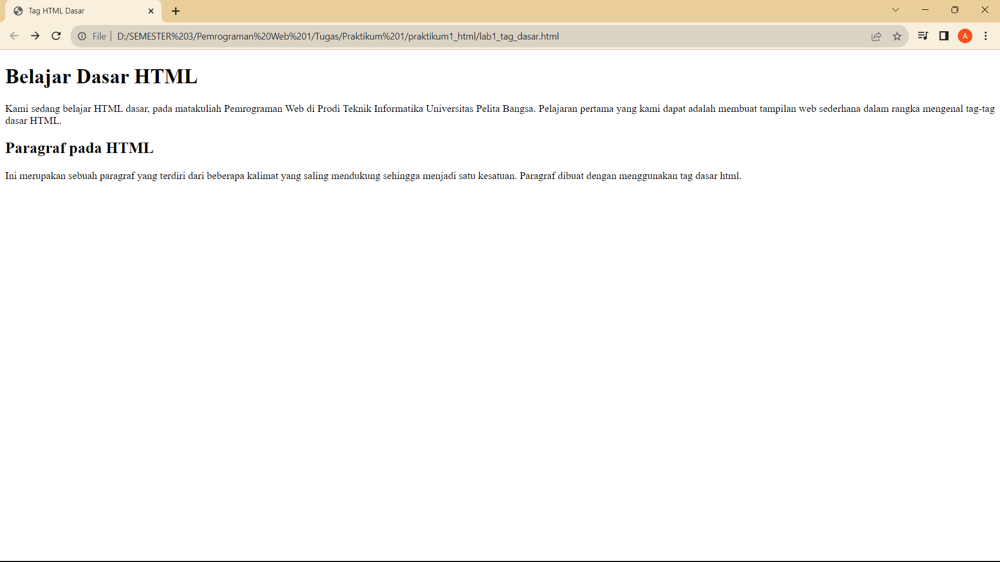
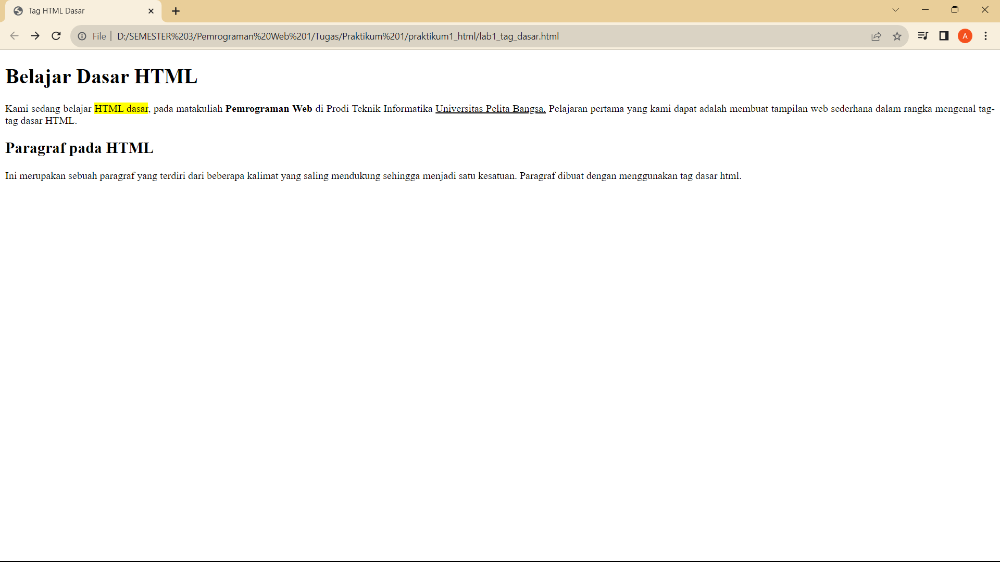
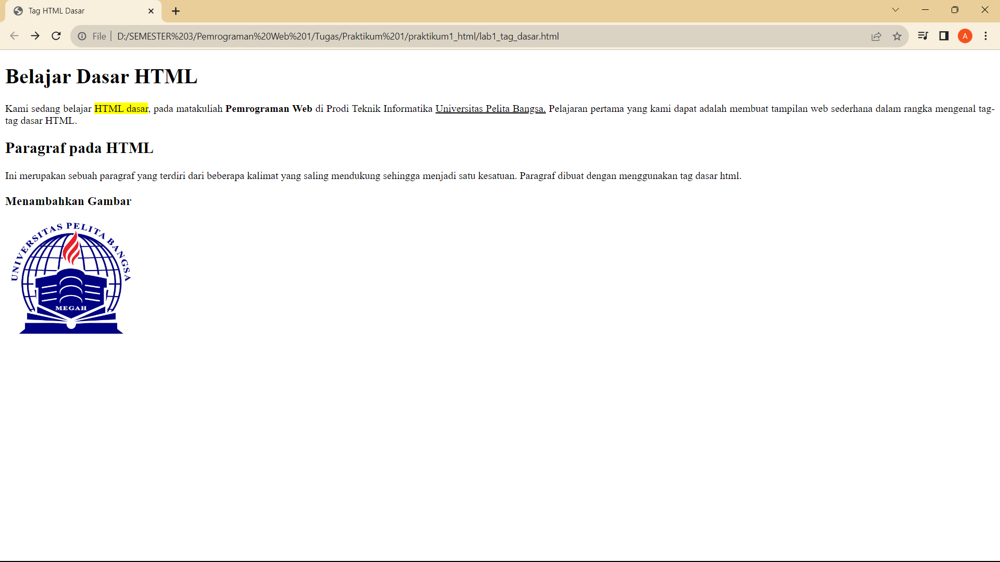
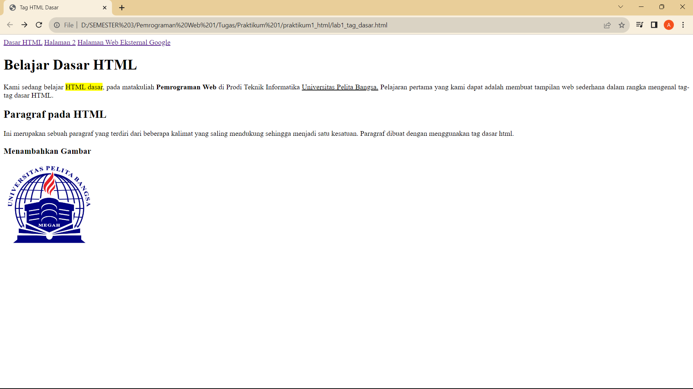
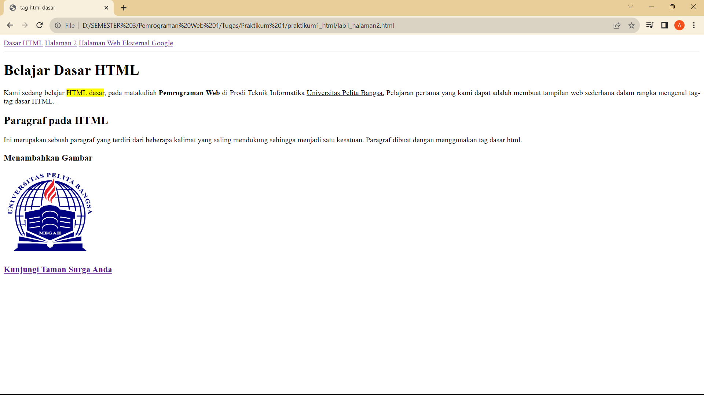
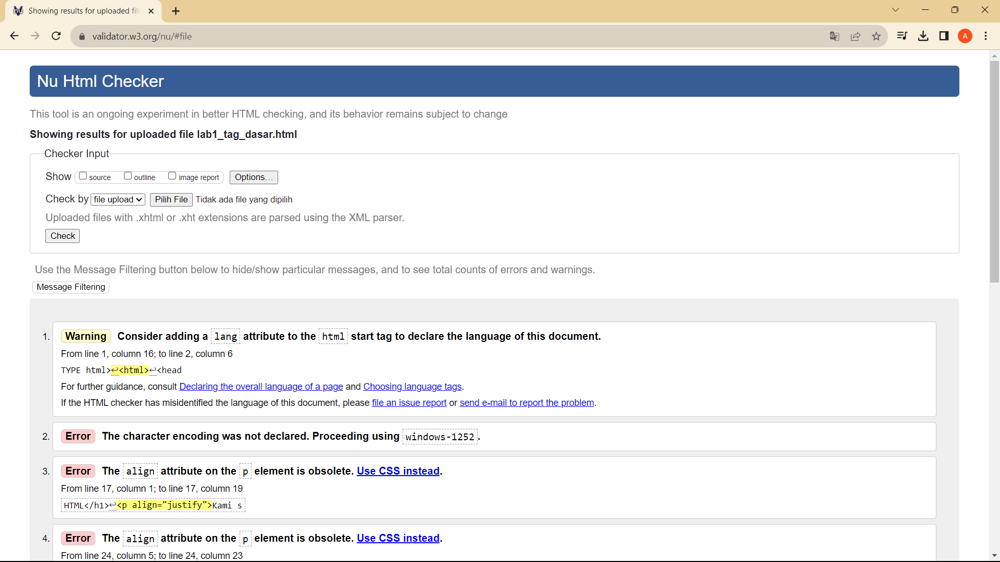

# praktikum1_html
# **Lab 1 Web**

```
Nama    : Assandra Julyant Firdausy
NIM     : 312210384
Kelas   : TI.2.A.4
MATKUL  : Pemrograman Web 1
```

## **Daftar Isi**

**1. [Instruksi Praktikum](#instruksi-praktikum)**  
**2. [Langkah-langkah Praktikum](#langkah-langkah-praktikum)**  
**3. [Jawab Pertanyaan Berikut](#jawab-pertanyaan-berikut)**

## **Instruksi Praktikum**

1. Persiapkan text editor, di sini saya menggunakan VSCode
2. Buat file baru dengan nama lab1_tag_dasar.html
3. Buat struktur dasar dari dokumen HTML.
4. Ikuti langkah-langkah praktikum yang akan dijelaskan berikutnya.
5. Lakukan validasi dokumen html dengan mengakses http://validator.w3.org

## **Langkah-langkah Praktikum**

1. Buka VSCode atau text editor, disini saya menggunakan VSCode karena saya terbiasa menggunakan VSCode.
   

2. Kemudian buat sebuah file dengan nama **tag_dasar.html**

3. Buatlah struktur dasar HTML

   ```html
   !DOCTYPE html>
   <html>
     <head>
       <title>Tag HTML Dasar</title>
     </head>

     <body></body>
   </html>
   ```

    

4. Lalu buka file tersebut pada web browser disini saya menggunakan web browser chrome.
       

**5. Membuat Paragraf**

```html
!DOCTYPE html>
<html>
  <head>
    <title>Tag HTML Dasar</title>
  </head>

  <body>
    <!-- Ini adalah paragraf pertama -->
    <p align="justify">
      Kami sedang belajar HTML dasar, pada matakuliah Pemrograman Web di Prodi
      Teknik Informatika Universitas Pelita Bangsa. Pelajaran pertama yang kami
      dapat adalah membuat tampilan web sederhana dalam rangka mengenal tag-tag
      dasar HTML.
    </p>
    <!-- Ini adalah paragraf kedua -->
    <p align="justify">
      Ini merupakan sebuah paragraf yang terdiri dari beberapa kalimat yang
      saling mendukung sehingga menjadi satu kesatuan. Paragraf dibuat dengan
      menggunakan tag dasar html.
    </p>
  </body>
</html>
```

  

Dalam HTML, atribut <b>align</b> digunakan untuk mengatur atau mengendalikan tata letak atau penempatan elemen tertentu dalam halaman web. Penggunaan atribut <b>align</b> bervariasi tergantung pada elemen HTML yang akan di gunakan. Pada elemen teks, <b>align</b> digunakan untuk mengatur penyebaran atau perataan teks. Nilai yang umum digunakan adalah "left" (kiri), "right" (kanan), "center" (tengah), dan "justify" (rata kiri dan kanan). Namun, perlu diperhatikan bahwa penggunaan atribut <b>align</b> telah usang dalam HTML versi yang lebih baru seperti HTML5. Sebaiknya, Anda menggunakan CSS untuk mengendalikan tata letak elemen dalam halaman web. CSS memberikan lebih banyak fleksibilitas dan kontrol dalam mengatur tata letak dan penampilan elemen.

**6. Menambahkan Judul**
h1 sampai h6 (opsional)

```html
<!-- judul paragraf pertama -->
<h1>Belajar Dasar HTML</h1>
<!-- judul paragraf kedua -->
<h2>Paragraf pada HTML</h2>
```

  

**7. Memformat teks**

```html
<p align="justify">
  Kami sedang belajar <mark>HTML dasar</mark> , pada matakuliah
  <b>Pemrograman Web</b> di Prodi Teknik Informasi
  <u>Universitas Pelita Bangsa</u>. Pelajaran pertama yang kami dapat adalah
  membuat tampilan web sederhana dalam rangka mengenal tag-tag dasar HTML.
</p>
```

  

**8. Menyisipkan gambar**

```html

```

  

gunakan juga atribut widht dan height untuk mengatur ukuran gambar yang akan di tampilkan nanti.

**9. Menambahkan hyperlink dan membuat satu file lagi dengan nama lab1_halaman2.html dengan isi yang sedikit berbeda**

Hyperlink ini berguna untuk berpindah halaman website atau berkunjung kehalaman website

```html
<nav>
    <a href="lab1_tag_dasar.html">Dasar HTML</a>
    <a href="lab1_halaman2.html">Halaman 2</a>
    <a href="http://www.google.com" target="_self" >Halaman Web Eksternal Google</a>
</nav>
```

  

Disini saya menggunakan atribut **target** yang berguna untuk membuka website/halaman di buka pada jendela yang sama.

*Isi lab1_halaman2.html*
  

**Melakukan validasi dokumen html**

  

## **Jawab Pertanyaan Berikut**

1. Lakukan perubahan pada kode sesuai dengan keinginan anda, amati perubahannya adakah
   error ketika terjadi kesalahan penulisan tag?      
   **Jawaban:**        
   <mark style="background-color:lightblue">Tidak terjadi error, tetapi tag/kode yang tidak sesuai tidak akan ditampilkan pada halaman website.</mark>

2. Apa perbedaan dari tag p dengan tag br, berikan penjelasannya!        
   **Jawaban:**         
   <mark style="background-color:lightblue"> tag <p> digunakan untuk membuat paragraf yang terpisah dengan jarak atas dan bawah, sementara tag <br> digunakan untuk membuat jeda baris dalam satu paragraf tanpa memulai paragraf baru. Sebagai aturan umum, sebaiknya menggunakan tag <p> ketika ingin mengorganisir teks menjadi paragraf terpisah, dan gunakan tag <br> jika hanya ingin membuat jeda baris dalam satu paragraf. Namun, dalam praktiknya, pengaturan tata letak teks lebih baik dicapai dengan menggunakan CSS daripada terlalu banyak menggunakan tag <br>.</mark>

3. Apa perbedaan atribut tittle dan alt pada tag img, berikan penjelasannya!  
   **Jawaban:**        
   <mark style="background-color:lightblue">Atribut title dan alt adalah untuk teks alternatif yang terbaca oleh perangkat pembaca layar dan digunakan dalam konteks aksesibilitas, sedangkan atribut title digunakan untuk memberikan informasi tambahan yang muncul saat pengguna mengarahkan kursor mouse ke gambar. Keduanya memiliki peran penting dalam meningkatkan pengalaman pengguna dan keterbacaan konten web.</mark>

4. Untuk mengatur ukuran gambar, digunakan atribut width dan height. Agar tampilan gambar proporsional sebaiknya kedua atribut tersebut diisi semua atau tidak? Berikan penjelasannya!        
   **Jawaban:**        
   <mark style=background-color:lightblue>untuk pengisian keduanya atau hanya salah satunya tergantung pada tujuan. Jika ingin menjaga proporsi asli, cukup isi salah satu atribut width atau height, dan biarkan atribut yang lainnya menjadi "auto." Jika ingin mengatur ukuran gambar secara eksplisit tanpa memperhatikan proporsi, isi keduanya.</mark>

5. Pada link tambahkan atribut target dengan nilai atribut bervariasi ( \_blank, \_self, \_top,
\_parent ), apa yang terjadi pada masing-masing nilai antribut tersebut?  
**Jawaban:**         
  <ul >
  <li><mark style=background-color:lightblue>_blank: Saat Anda mengatur atribut target menjadi _blank, tautan akan dibuka dalam jendela atau tab browser yang baru. Ini akan memisahkan tautan dari halaman asal. Pengguna dapat kembali ke halaman asal dengan menutup jendela/tab baru tersebut.</mark></li>

  <li><mark style=background-color:lightblue>_self: Ini adalah perilaku default. Saat Anda tidak menyebutkan atribut target atau mengaturnya menjadi _self, tautan akan dibuka di jendela/tab yang sama di mana tautan tersebut berada. Ini berarti halaman saat ini akan digantikan oleh halaman baru yang ditautkan, menggantikan isi halaman saat ini..</mark></li>

  <li><mark style=background-color:lightblue>_top: Saat Anda mengatur atribut target menjadi _top, tautan akan membuka halaman baru di jendela/tab utama, menggantikan seluruh konten yang ada di jendela/tab saat ini, termasuk frame jika ada. Ini berguna jika Anda memiliki frame (frame HTML) di dalam halaman web dan ingin tautan membuka halaman baru di jendela/tab utama.</mark></li>

  <li><mark style=background-color:lightblue>_parent: Atribut target dengan nilai _parent digunakan untuk membuka tautan di frame induk jika halaman web menggunakan frame (frame HTML). Jika tautan ini digunakan dalam satu frame, maka halaman baru akan dimuat dalam frame yang berisi frame saat ini. Jika tidak ada frame induk, perilaku akan mirip dengan _self.</mark>.</li>

  </ul>